## 🔨 Projetos

O que construí ou estou construindo — abre e testa:

| Projeto | O que é |
|---|---|
| ... | ... |

> Todos os repos em [github.com/JoaoMendss](https://github.com/JoaoMendss)

## 🗻 Vida em commits

## 📫 Contato

  

volta por volta.

